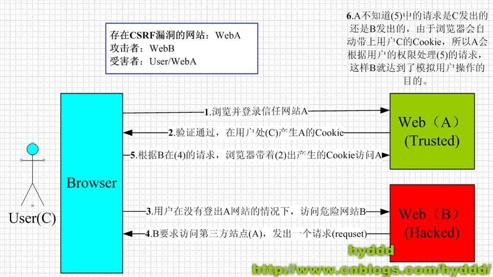

### 一、CSRF是什么？
CSRF（Cross-site request forgery），中文名称：跨站请求伪造，也被称为：one click attack/session riding，缩写为：CSRF/XSRF。
本质是：攻击者盗用了你的身份，以你的名义发送恶意请求
### 二、原理

从上图可以看出，要完成一次CSRF攻击，受害者必须依次完成两个步骤：
1. 登录受信任网站A，并在本地生成Cookie
2. 在不登出A的情况下，访问危险网站B

---
http://www.cnblogs.com/hyddd/archive/2009/04/09/1432744.html

